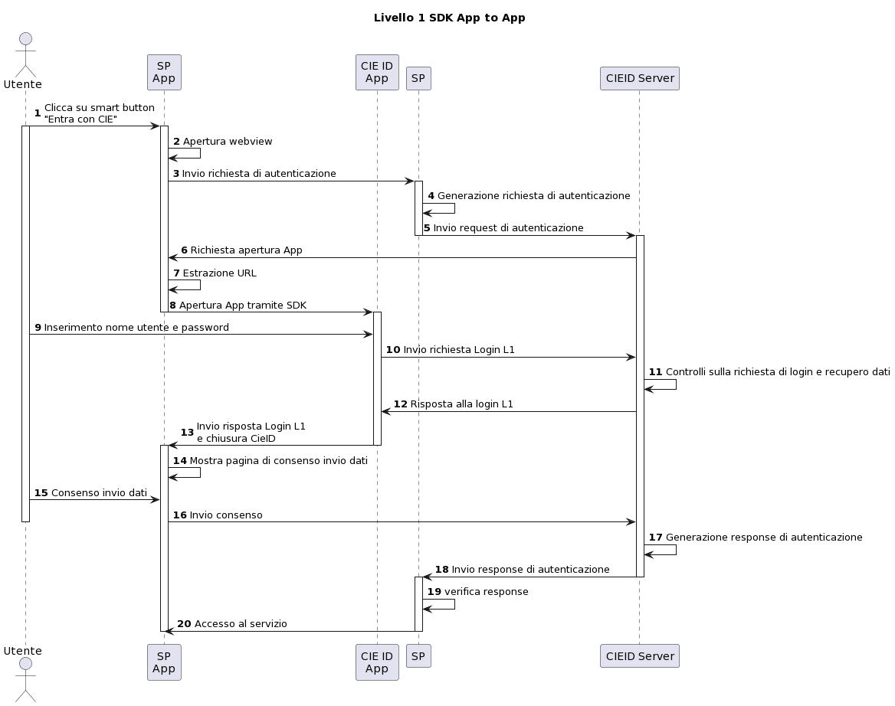
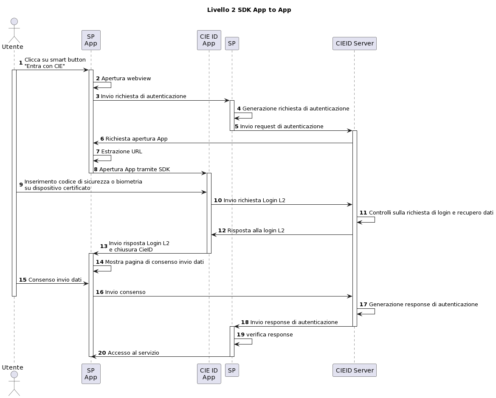
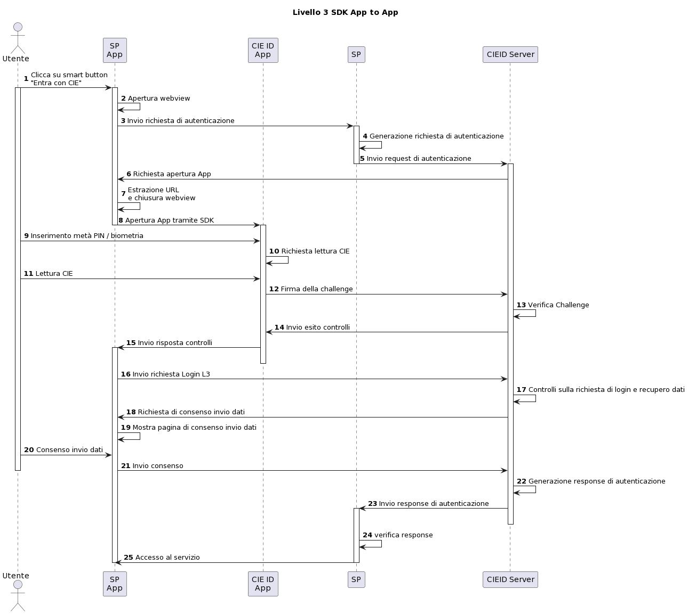
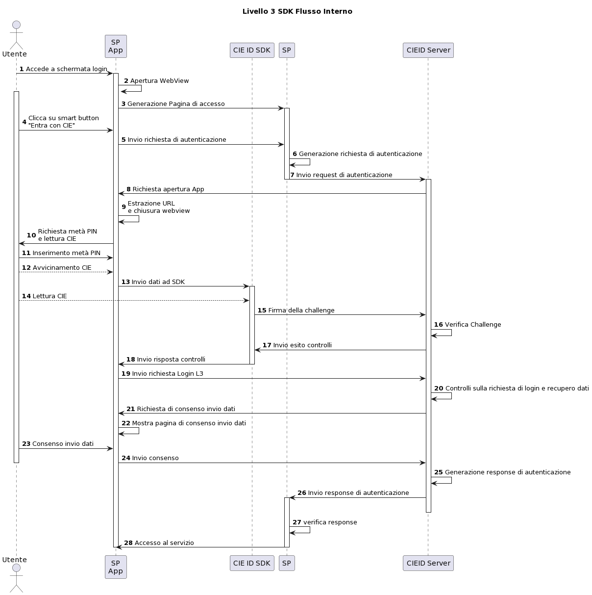

==============
SDK App Mobile 
==============

I Service Provider che intendono erogare i propri servizi tramite
proprie app hanno la possibilità di integrare lo schema di
autenticazione «Entra con CIE» mediante l’SDK CieID. I flussi di
integrazione disponibili sono due:

**Flusso con reindirizzamento**

L’App del Service Provider, all’atto della richiesta di autenticazione
dell’utente, reindirizza la richiesta all’App CieID che prende in carico
la comunicazione e l’autenticazione con la CIE.

    Autenticazione di livello 1 - Flusso con reindirizzamento

    Autenticazione di livello 2 - Flusso con reindirizzamento

    Autenticazione di livello 3 - Flusso con reindirizzamento

**Flusso integrato**

Il processo di autenticazione viene effettuato direttamente all’interno
dell’app del Service Provider, il quale integra la comunicazione con la
CIE mediante una libreria SDK, disponibile sia per sistemi operativi
Android che iOS.

    Autenticazione di livello 3 - Flusso interno

.. _sec-sdk-android:

SDK Android
===========

La versione del SDK per Android, \**CieID-android-sdk**, è disponibile
al link
`https://github.com/italia/ <https://github.com/italia/cieid-android-sdk>`__
`cieid-android-sdk <https://github.com/italia/cieid-android-sdk>`__. É
costituita da una libreria software, realizzata in codice nativo Android
Kotlin, e integra una app di esempio che descrive le diverse modalitá di
integrazione dello schema «Entra con CIE»:

Requisiti di integrazione
~~~~~~~~~~~~~~~~~~~~~~~~~

L’utilizzo dell’SDK presuppone che il Service Provider sia correttamente
federato con l’Identity Provider e che abbia implementato almeno uno tra
i protocolli previsti dallo schema di autenticazione «Entra con CIE”.

Inoltre, è necessario che i seguenti requisiti siano soddisfatti:

-  versione Android 6.0 (API level 23) o successive;

-  utilizzo di un dispositivo mobile dotato di tecnologia NFC;

-  disponibilità di una connessione internet

Configurazione
~~~~~~~~~~~~~~

Dell’IdP sono messi a disposizione degli erogatori di servizi due
ambienti: uno di **preproduzione**, per gli sviluppi applicativi e i
test di federazione e l’altro di **produzione**, per il deploy in
esercizio. Difatti, per l’impiego di un’app terza con uno dei flussi
disponibili è necessaria una fase iniziale di configurazione, che
dipende dal tipo di flusso adottato.

Entrambi i flussi vengono avviati tramite l’utilizzo di una *Webview*: é
necessario caricare la URL del Service Provider che integra il pulsante
«Entra con CIE» come mostrato nell’esempio:

..  code-block:: java

	*//inserire url service provider*
	webView.loadUrl("URL del Service Provider")
    

**Flusso con reindirizzamento**

Nel caso di *flusso con reindirizzamento*, per far proseguire
correttamente il flusso, è necessario selezionare l’applica- zione
*«CieID»* a cui indirizzare le richieste di autenticazione. Ciò può
essere fatto modificando i commenti dalle righe di interesse, come
mostrato di seguito.

..  code-block:: java

	val appPackageName = "it.ipzs.cieid"
	*//COLLAUDO*
	*//val appPackageName = "it.ipzs.cieid.collaudo"*

**Flusso integrato**

Per quanto riguarda il *flusso integrato*, invece, la fase di
autenticazione viene gestita dalla libreria software. In questo caso é
necessario integrare il modulo «CieIDSdk»:

L’SDK utilizza *Gradle* con strumento di build automatico. Per
configurare correttamente il flusso, é necessario selezionare l’ambiente
server dell’Identity Provider a cui indirizzare le richieste di
autenticazione. Ció puó essere fatto modificando il file *build.gradle*
modificando i commenti dalle righe di interesse, come mostrato di
seguito:

..  code-block:: java

	*//AMBIENTI:*
	*//Ambiente di produzione*
	*//buildConfigField "String", "BASE_URL_IDP",
	"\"https://idserver.servizicie.interno.gov.it/idp/"\"*

	*//Ambiente di collaudo*
	*//buildConfigField "String", "BASE_URL_IDP",
	"\"https://preproduzione.idserver.servizicie.interno.gov.it/idp/"\"*

Modalità di integrazione
~~~~~~~~~~~~~~~~~~~~~~~~

L’SDK fornisce una app di esempio, con 2 activity, una per flusso, per
facilitare al Service Provider l’integrazione all’interno della propria
App. La gestione degli errori è demandata all’app integrante.

**Integrazione del flusso con reindirizzamento**

Per integrare nativamente le funzionalità dell’SDK é necessario, per
prima cosa, intercettare la URL contenente il valore «/OpenApp» ed
avviare l’App CieID integrando il codice seguente:

..  code-block:: java

	val intent = Intent()
	**try** {

		intent.setClassName(appPackageName, className)
		*//settare la url caricata dalla webview su /OpenApp*
		intent.data = Uri.parse(url)
		intent.action = Intent.ACTION_VIEW
		startActivityForResult(intent, 0)
	} **catch** (a : ActivityNotFoundException) {
		startActivity(

			Intent(

				Intent.ACTION_VIEW,

				Uri.parse("https://play.google.com/store/apps/details?id=$appPackageName")

			)

		)

	)

	**return true**

Una volta avviata correttamente l’App CieID, avviene l’autenticazione
tramite la CIE, e al termine viene restituita una nuova URL da ricarica
nella WebView precedente, come mostrato nell’esempio seguente:

..  code-block:: java

	override fun onActivityResult(requestCode: Int, resultCode: Int, data: Intent?) {

		**super**.onActivityResult(requestCode, resultCode, data)
		val url = data?.getStringExtra(URL)

		webView.loadUrl(url)
		
	}

**Integrazione del flusso integrato**

Per integrare le funzionalità dell’SDK si utilizzano i seguenti metodi:

..  code-block:: java

	*//Configurazione iniziale*

	CieIDSdk.start(activity, callback)

	*//Avvio utilizzo NFC*

	CieIDSdk.startNFCListening(activity)

	*//Abilitare o disabilitare i log, da disattivare in produzione*

	CieIDSdk.enableLog = **true**

	*//Bisogna settare la url caricata dalla pagina web dell' SP dalla
	webview su /OpenApp*

	CieIDSdk.setUrl(url.toString())

	*//inserire il pin della CIE*

	CieIDSdk.pin = input.text.toString()

	*//Avviare NFC*

	startNFC()

É necessario, inoltre, realizzare le interfacce di Callback
implementando i seguenti metodi:

..  code-block:: java

	override fun onEvent(event: Event) {

	*//evento*

	}

	override fun onError(e: Throwable) {

	*//caso di errore*

	}

	override fun onSuccess(url: String) {

	*//caso di successo con url della pagina da caricare*

	}

.. _sec-sdk-ios:

SDK iOS
=======

CieID-iOS-sdk è un SDK per smartphone iOS sviluppato in Swift che
include le funzionalità di autenticazione di

«Entra con CIE». Utilizzando questo kit, gli sviluppatori di
applicazioni terze iOS possono integrare nella propria app
l’autenticazione mediante la Carta d’identità elettronica.

Requisiti tecnici
~~~~~~~~~~~~~~~~~

CieID-iOS-sdk richiede versione iOS 13.0 o successive, inoltre è
necessario uno smartphone iOS con tecnologia NFC (iPhone 7 o successivo,
non è compatibile con iPhone SE di prima generazione - mod 2016).

.. _requisiti-di-integrazione-1:

Requisiti di integrazione
~~~~~~~~~~~~~~~~~~~~~~~~~

L’utilizzo dell’SDK presuppone che il Service Provider sia correttamente
federato con l’Identity Provider e che abbia implementato almeno uno tra
i protocolli previsti dallo schema di autenticazione «Entra con CIE».

Come si usa
~~~~~~~~~~~

Il kit integra prevede il solo flusso di autenticazione con
reindirizzamento di seguito descritto. L’integrazione richiede pochi
semplici passaggi:

-  Importazione del kit all’interno del progetto

-  Configurazione dell’URL Scheme

-  Configurazione dell’URL di un Service Provider valido all’interno del
   file Info.plist

-  Configurazione dello smart button Entra con CIE all’interno dello
   storyboard

-  Inizializzazione e presentazione della webView di autenticazione

-  Gestione dei delegati

Flusso con reindirizzamento
~~~~~~~~~~~~~~~~~~~~~~~~~~~

Il flusso di autenticazione con reindirizzamento permette ad un Service
Provider accreditato di integrare l’autenticazio- ne Entra con CIE nella
propria app iOS, demandando le operazioni di autenticazione all’app
CieID. Questo flusso di autenticazione richiede che l’utente abbia l’app
CieID installata sul proprio smartphone in **versione 1.2.1 o
successiva**.

Flusso interno
~~~~~~~~~~~~~~

Non disponibile.

Importazione
~~~~~~~~~~~~

Trascinare il folder CieIDsdk all’interno del progetto xCode

Configurazione URL Scheme
~~~~~~~~~~~~~~~~~~~~~~~~~

Nel flusso di autenticazione con reindirizzamento l’applicazione CieID
avrà bisogno aprire l’app chiamante per potergli notificare l’avvenuta
autenticazione. A tal fine è necessario configurare un URL Scheme nel
progetto Xcode come segue:

Selezionare il progetto **Target**, aprire il pannello **Info** ed
aprire poi il pannello **URL Types**. Compilare i campi

**Identifier** e **URL Scheme** inserendo il **Bundle Identifier**
dell’app, impostare poi su **none** il campo **Role**.

Il parametro appena inserito nel campo **URL Scheme** dovrà essere
riportato nel file **Info.plist**, aggiungendo un parametro chiamato
**SP_URL_SCHEME** di tipo **String**, come mostrato nell’esempio:

..  code-block:: java

	**<key>**\ SP_URL_SCHEME\ **</key>**
	**<string>**\ Inserisci qui il parametro URL Scheme\ **</string>**

A seguito dell’apertura dell’app la webView dovrà ricevere un nuovo URL
e proseguire la navigazione. Di seguito si riporta il metodo
**openUrlContext** da importare nello **SceneDelegate** che implementa
tale logica:

..  code-block:: java

	**func** scene(\ **\_** scene: UIScene, openURLContexts URLContexts: Set<UIOpenURLContext>) {
		**guard let** url = URLContexts.first?.url **else** {
			**return**
		}

		**var** urlString : String = String(url.absoluteString)
		**if let** httpsRange = urlString.range(of: "https://"){
		
		*//Rimozione del prefisso dell'URL SCHEME*
		**let** startPos = urlString.distance(from: urlString.startIndex, to: httpsRange.lowerBound)

        urlString = String(urlString.dropFirst(startPos))

		*//Passaggio dell'URL alla WebView*
		
		**let** response : [String:String] = ["payload": urlString]
		**let** NOTIFICATION_NAME : String = "RETURN_FROM_CIEID"

		NotificationCenter.\ **default**.post(name:         Notification.Name(NOTIFICATION\_NAME), object: **nil**, userInfo: response)
			}
	}

Configurazione Service Provider URL
~~~~~~~~~~~~~~~~~~~~~~~~~~~~~~~~~~~

Entrambi i flussi vengono avviati tramite l’utilizzo di una WebView, per
questo motivo è necessario caricare la URL dell’ambiente di produzione
della pagina web del Service Provider che integra il pulsante «Entra con
CIE» all’interno del file **Info.plist**, aggiungendo un parametro
chiamato **SP_URL** di tipo **String**, come mostrato nell’esempio:

..  code-block:: java

	**<key>**\ SP_URL\ **</key>**
	**<string>**\ Inserisci qui l'URL dell'ambiente di produzione del Service Provider\ **</string>**

Importazione del pulsante Entra con CIE
~~~~~~~~~~~~~~~~~~~~~~~~~~~~~~~~~~~~~~~

Aggiungere nello storyboard di progetto un oggetto di tipo **UIButton**
ed inserire nella voce **Class** del menù **Iden- tity inspector** la
classe che lo gestisce: **CieIDButton**. L’oggetto grafico verrà
automaticamente renderizzato con il pulsante ufficiale “\ *Entra con
CIE*\ ”.

Eseguire l’autenticazione
~~~~~~~~~~~~~~~~~~~~~~~~~

Di seguito un esempio di gestione dell’evento **TouchUpInside** per
eseguire il codice necessario per inizializzare e presentare la WebView
di autenticazione.

..  code-block:: java

	**@IBAction func** startAuthentication(\ **\_** sender: UIButton){

		**let** cieIDAuthenticator = CieIDWKWebViewController()
		cieIDAuthenticator.modalPresentationStyle = .fullScreen
		cieIDAuthenticator.delegate = **self** present(cieIDAuthenticator,
		animated: **true**, completion: **nil**)
	}

La classe chiamante dovrà essere conforme al protocollo
**CieIdDelegate** come mostrato nell’esempio.

..  code-block:: java

	**class ExampleViewController**: UIViewController, CieIdDelegate {
	...
	}

L’utente potrà navigare nella webView mostrata che lo indirizzerà
sull’app CieID dove potrà eseguire l’autenticazione con la Carta di
Identità Elettronica, al termine verrà nuovamente reindirizzato sull’app
chiamante in cui potrà dare il consenso alla condivisione delle
informazioni personali e portare al termine l’autenticazione.

Al termine dell’autenticazione verrà chiamato il delegato
**CieIDAuthenticationClosedWithSuccess**. La chiamata di questo delegato
avviene nella classe **CieIDWKWebViewController**. Potrebbe rendersi
necessario posticipare la chiamata di questo delegato in base alla
logica di autenticazione del Service Provider.

Gestione eventi
~~~~~~~~~~~~~~~

Il protocollo impone la gestione dei seguenti eventi mediante delegati

..  code-block:: java

	**func** CieIDAuthenticationClosedWithSuccess() { 
				print("Authentication closed with SUCCESS")

	}

..  code-block:: java

	**func** CieIDAuthenticationCanceled() { 
				print("L'utente ha annullato l'operazione")

	}

..  code-block:: java

	**func** CieIDAuthenticationClosedWithError(errorMessage: String) {
				print("ERROR MESSAGE: *\\(*\ errorMessage\ *)*")

	}

.. _sec-licenza:

Licenza
=======

Il codice sorgente è rilasciato sotto licenza BSD (codice SPDX:
BSD-3-Clause).
