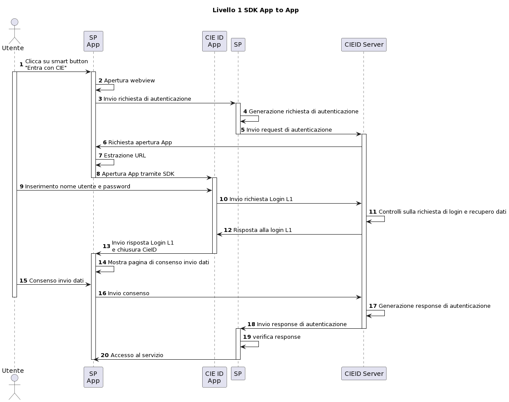
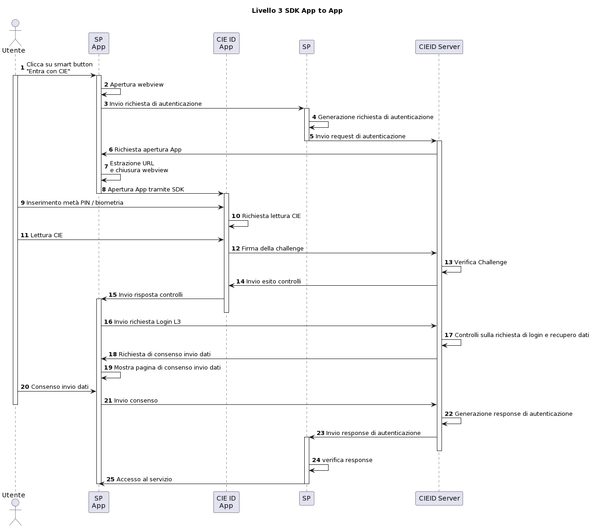

Flussi di autenticazione
========================

In questa Sezione sono descritti i principali flussi di autenticazione che è possibile integrare all'interno delle Applicazioni Mobile dei Fornitori di Servizi.

Flusso con reindirizzamento
---------------------------

L'App del Service Provider, all'atto della richiesta di autenticazione
dell'utente, reindirizza la richiesta all'App CieID che cura i dettagli
la comunicazione e l'autenticazione con la CIE, mascherando tali aspetti all'applicazione chiamante.

    Autenticazione di livello 1 - Flusso con reindirizzamento

.. figure:: ../../media/image2.png
    :alt: Autenticazione livello 2 - Flusso con reindirizzamento
    :width: 15 cm
    :name: aut-livello2
    :align: center

    Autenticazione di livello 2 - Flusso con reindirizzamento

    Autenticazione di livello 3 - Flusso con reindirizzamento

Flusso integrato
----------------

Il processo di autenticazione viene effettuato direttamente all'interno
dell'app del Service Provider, il quale integra la comunicazione con la
CIE mediante una libreria SDK, disponibile sia per sistemi operativi
Android che iOS.

.. figure:: ../../media/image4.png
    :alt: Autenticazione livello 3 - flusso interno
    :width: 15 cm
    :name: aut-livello3-interno
    :align: center

    Autenticazione di livello 3 - Flusso interno

